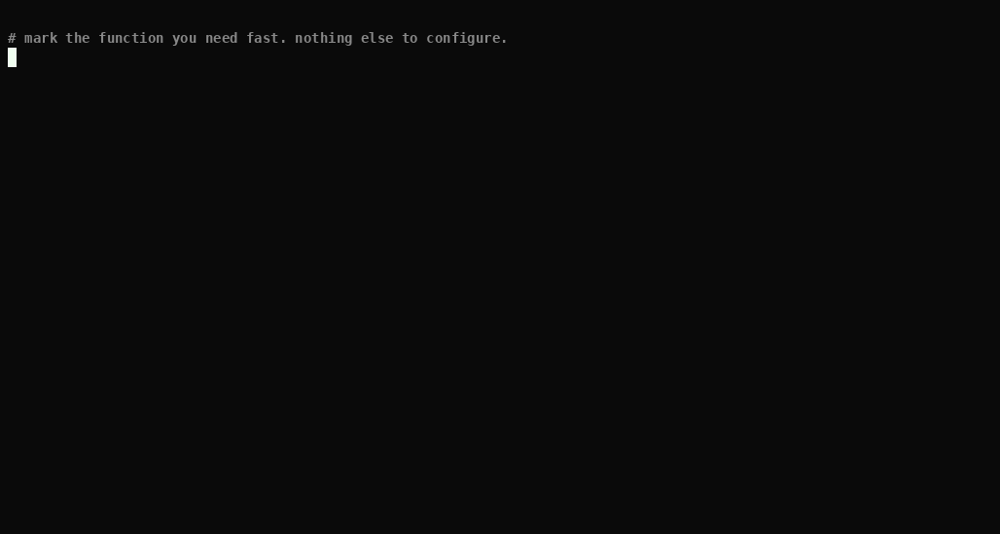

# jitmax

Mark a TypeScript function `/** @jitmax */` and jitmax tells you which lines in
it, and in everything it calls, are patterns measured to push V8 off its fast
path.

The annotation is you saying "this function has to be fast". A finding is one
line, the fix for it, and the benchmark that priced the rule. When the tool
could not see everything — a call it cannot follow, a module that will not
resolve — it says so and exits non-zero, because a run that proves nothing
about part of your call tree is not a clean run.



## Quick start

From the root of a TypeScript repository:

```sh
bunx github:kronael/jitmax
```

`npx github:kronael/jitmax` does the same, and needs one more step to get
there: Node refuses to strip types from any file under `node_modules`, so npm's
`prepare` compiles `dist/` on install and the `bin` entry runs that. Bun reads
TypeScript anywhere and runs the source. Prefer `bunx`.

With no path argument jitmax reads the repository's `tsconfig.json`, including
its module resolution and file list. It is not on npm, so use the repository
URL as the package name. The remote does not have a published Git ref yet, so
this public install remains blocked by TC-133.

Mark the function you need fast:

```ts
/** @jitmax */
export function total(rows: Row[]): number { … }
```

From a checkout, `npm install` once, then run it from your repository root:

```sh
node /path/to/jitmax/bin/jitmax.ts
```

Pass paths to narrow what is scanned. They choose the file list and nothing
else: the compiler options still come from the `tsconfig.json` found from the
directory you run in, so run from the root of the repository you are naming.

**Turn a rule off** in a TOML file, given as the first positional argument and
recognised by its `.toml` suffix. Neither layer is required — with no config
and no overrides, jitmax behaves exactly as above:

```toml
[rules]
"megamorphic-elements" = false
"TC-9" = false
```

or per function, in the same comment as the annotation:

```ts
/** @jitmax -megamorphic-elements -TC-9 */
export function other(rows: Row[]): number { … }
```

A rule name switches off that rule; a defect code switches off every rule
carrying it. Suppression is never silent — the report says how many findings
were removed and by what. `docs/rules.md` has both layers in full.

**Or let a profile decide what is hot.** The annotation is you asserting a
function is hot; a profile is a measurement of it:

```sh
node --cpu-prof --cpu-prof-dir=. your-workload.js
jitmax run.cpuprofile src
```

Every function at or above `[profile] min_self_pct` of the profile's sampled
self time is marked, and the report says what marked it. Nothing else changes:
the walk, the rules and the exit code cannot tell a profiled mark from an
annotated one. `ARCHITECTURE.md` has the source-map handling.

## The eight rules

Eight rules ship. The first six check every function in the call tree; the last
two report where the walk stopped. *Megamorphic* means one code location has
seen many object shapes — V8 caches four per site, and the fifth costs you the
cache. Every cost below is a microbenchmark on one machine, and it is a
property of the input as much as of the code.

| Rule | What it looks for | Measured |
|---|---|---|
| [`megamorphic-elements`](docs/rules.md#megamorphic-elements) | the fifth distinct property set at a load site | 3.4-11.3x |
| [`megamorphic-dispatch`](docs/rules.md#megamorphic-dispatch) | `x.step()` where `x` is one of five object types | 12.9-22.7x |
| [`accumulating-spread`](docs/rules.md#accumulating-spread) | `[...acc, v]` or `{ ...acc, k: v }` in a loop — quadratic | 149-166x |
| [`chained-allocation`](docs/rules.md#chained-allocation) | `.map().filter()` allocates a whole array between stages | 1.44-1.52x |
| [`allocating-select`](docs/rules.md#allocating-select) | `x = Lib.min(x, y)` in a loop returns a new object every pass | 2.56-2.87x |
| [`delete-property`](docs/rules.md#delete-property) | `delete` demotes an object to dictionary mode | 12.3-13.6x |
| [`closed-world`](docs/rules.md#closed-world) | a callee with no readable body anywhere in the checkout | 4.64-4.95x |
| [`interface-dispatch`](docs/rules.md#interface-dispatch) | a call whose body IS here but cannot be picked | no claim |

No cost is printed beside a finding. The tool cannot see how big the data
running through that line will be, and the ratio depends on it.

## What a finding looks like

```
jitmax — 59 annotated functions, 29 errors

  demo/lib.ts:164  viaCallee()
    error  delete-property
      demo/lib.ts:159
      delete o[k] puts its object in dictionary mode
      fix: assign undefined where the key may stay present — equivalent only while nothing
      downstream tells an absent key from one holding undefined (spread and Object.assign copy
      it; `in`, for-in, hasOwnProperty, Object.keys, Object.values, Object.entries,
      Object.getOwnPropertyNames and Reflect.ownKeys see it; JSON.stringify does not, it omits
      both) — or build the object without the key — the rebuild helps at the smaller of n=12
      and n=48 and not at the larger, where filling it key by key normalizes it too
      measured in bench/delete.jl
      known defect: TC-9 — rules fire outside the conditions their own evidence establishes
```

Four things, and the second is the point:

- **the line** — which is inside `dropInner`, a function nobody annotated.
  `viaCallee` has the annotation; jitmax followed the call and reported where
  the cost actually is.
- **the sweep that priced the rule**, named, so you can read the cost in
  `bench/README.md` and re-run it yourself with `make bench-*`.
- **the fix**, concretely, not "consider optimising" — and where the fix itself
  stops paying, wherever applying it to somebody else's function found a limit.
- **what it could not check** — a call that resolves to a declaration with no
  body is listed by name, and a walk that hits its limit prints
  `WALK TRUNCATED`, exits `1`, and is never reported as clean.

## What it guarantees

Exit `0` clean, `1` a finding to report OR could not see everything, `2` the
tool itself failed. A path that does not exist is a `2`, never a clean run.
Warnings alone do not fail a run.

Four things are a `1` with no finding in them, because a run that proves
nothing about part of your call tree is not a clean run either: a walk that hit
its limit, a module that would not resolve (every type it declares reads as
`any`, so every type-based rule went quiet on the files importing it), a hot
frame in a profile that matched no function in these sources, and a call that
reads a method off a value typed `any` — nothing resolves there, so the tool
cannot tell a `Map` builtin from your own code and says so instead of naming a
body it never found (`BUGS.md` TC-129).

Every finding is an error, and every error fails the run. The annotation is the
filter: a finding on a function you said must be fast is actionable by
definition, so a second severity tier would gate nobody.

## What it costs to be wrong

One number, so it can be checked rather than admired. Rebuilding an
accumulator inside a loop — `acc = [...acc, r]` — measured **149-166x** slower
than pushing onto it, at n=1000 with construction counted:

```sh
make bench-spread
```

The caveat is the size of the effect, not its direction: the same rule on the
same machine measures 1766-1889x at n=10000, and applied to a function radash
ships it moves the whole call 3.22-4.65x, because the code around that one line
also allocates, recurses and branches. A microbenchmark cannot say what a
program gets. `bench/README.md` has every number, the rows it came from, and
the protocol; `examples/README.md` has what four real fixes were worth.

## Why this exists

V8 already optimises your code well. But a short list of ordinary-looking
patterns quietly turns those optimisations off, and nothing warns you. This is
that list, measured.

*Where the idea came from:* Numba's `@njit` marks one Python function and pulls
in its whole call tree. It compiles that tree or stops with a line and a reason.
jitmax borrows the annotation and the call-tree walk. The jobs differ:
CPython does not JIT, so Numba must compile; V8 does, so jitmax only tells
you where your code blocks it.

## When NOT to use this

- **You want a profiler.** This is a static checker. It cannot see how hot a
  line is unless you hand it a `--cpu-prof` profile, and it never guesses.
- **You want a number for your program.** Every ratio here comes from a
  microbenchmark on one machine, with Maglev switched off. It shows a pattern
  *can* cost that much, never that it costs that much in your workload.
- **Your hot pattern is spread over two functions.** Every rule matches inside
  one body. Hoisting the measured pattern into a helper silences the tool.
- **You need the rule to know your data.** Rules fire outside the conditions
  their own evidence establishes — the `delete` rule does not know whether
  anything reads the object afterwards, and its cost is per read. That is
  `BUGS.md` TC-9, and it is printed under every finding of the rules that
  carry it.
- **You run from outside the repository whose paths you name.** The
  `tsconfig.json` is found from the working directory and never from the path
  argument, so `jitmax ../other/src` compiles `../other` under this directory's
  options and its path aliases go unresolved. The run says so, and names the
  config it should have read (`BUGS.md` TC-76).
- **You want the two escape rules quiet by default.** `closed-world` and
  `interface-dispatch` were 96% of every finding across twelve libraries, and
  they are errors. Switch them off in `[rules]` if you disagree.

`docs/limits.md` is the full list, including the two cells that failed
replication and the 601 rows measured under a load gate that could not see a
tenant.

## Requirements

Node `>=22.18`, which strips types itself, so running the tool needs no build
step. TypeScript `>=5.0.0` as a peer dependency — jitmax loads *your* copy, so
it parses with the same compiler your build does, and it needs the 5.x API
(`BUGS.md` TC-130).

## Development

```sh
make          # lint, test, check
make verify   # everything a release needs: all, v8-check, reality
```

`make` never runs `make build`: regenerating the derived artifacts right before
the drift assertions would compare fresh output against fresh output, and a
stale committed artifact could never fail again. `ARCHITECTURE.md` has the rest
of the targets, `CLAUDE.md` the repository's own rules and the measurement
protocol.

## Licence

**GPL-2.0-only**. The full text is in `LICENSE`. You may use, modify and
redistribute it under those terms. A derivative work carries the same licence.
It is not published to npm, and the GitHub remote has no public ref yet. TC-133
tracks that distribution blocker.

`examples/` is the exception, and deliberately so: the `.before.ts` files are
functions vendored verbatim from radash, remeda, es-toolkit and zod, all
**MIT**, and each file carries its upstream's copyright line, version and
commit. Those files stay under their upstream MIT licence rather than the GPL,
and `examples/LICENSE-MIT` reproduces the permission notice MIT requires to
travel with them, alongside the four copyright holders and the commit each
function came from. The point of the whole exercise is that the code measured
there is somebody else's.

V8 is a trademark of Google LLC. This project is not affiliated with, endorsed
by, or sponsored by Google, and every use of the name here is a reference to the
engine the measurements were taken on.

Status: v0.12.3, single machine, eight rules. Every sweep behind a published
number is re-measured whole under the current runner, except `bench/arrays.jl`,
whose three figures price a withdrawn rule and say so where they are printed:
three sweeps per cell, and a cell whose three share no common value is withdrawn
by `lib/derive.ts` before the number is written. 31 are withdrawn today, and
`test/check.test.ts` lists every one.

## How to read this

Each file answers one question. Nothing is repeated between them.

| File | The question it answers |
|---|---|
| `README.md` | What is this, why use it, how do I start |
| `ARCHITECTURE.md` | How is it built inside |
| `docs/rules.md` | What does each rule detect, and what is the fix |
| `docs/limits.md` | Where does it not work |
| `bench/README.md` | How is every number measured, and how do I re-check it |
| `test/README.md` | What does the suite guard, and how do I run one test |
| `examples/README.md` | What is a fix worth on somebody else's code |
| `CLAUDE.md` | The rules of this repository, and the measurement protocol |
| `BUGS.md` | The open queue: found during audits, fixed when asked |
